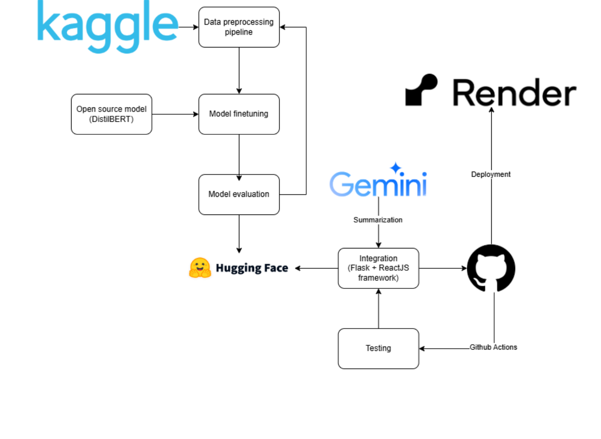
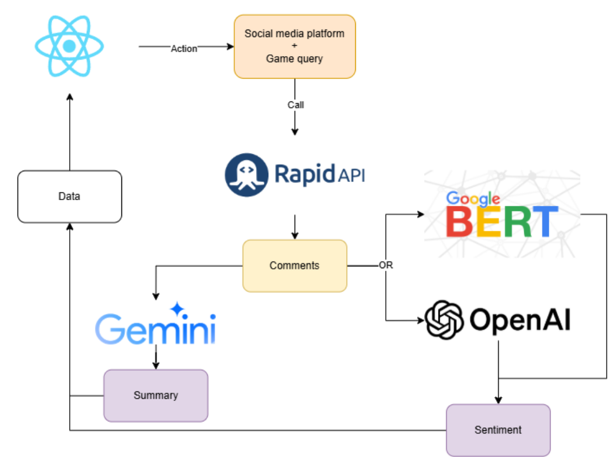
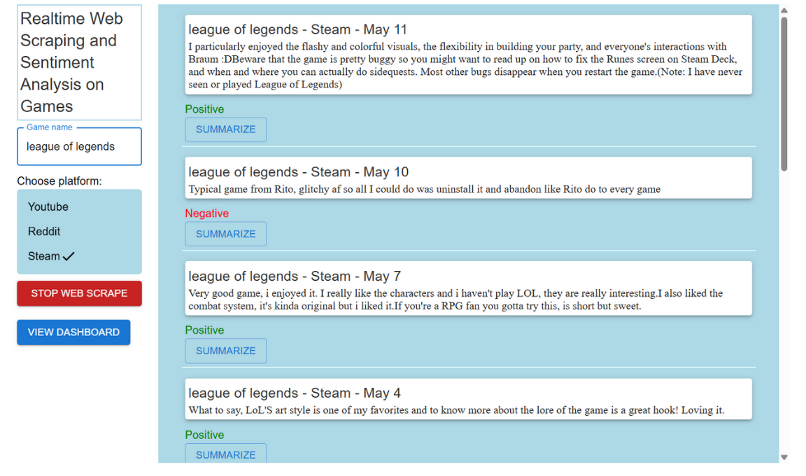

# GaaS - Game as a Service - Natural Language Processing and Application project

# Topic: Social Media Sentiment Analysis Scraper 
---

## 1. Brief introduction
The gaming industry is saturated with a wide variety of games, making it difficult for consumers to identify titles that suit their preferences. At the same time, developers often struggle to gather actionable insights into how their games are perceived by players. There is a growing need for a centralized platform that bridges this gap by providing meaningful data and analysis for both sides of the market.

To build **GaaS (Games as a Service)**—a web platform that helps consumers make informed decisions when purchasing games by offering detailed reviews, player feedback analysis, and game comparisons, while also supporting businesses in understanding player needs, identifying game strengths and weaknesses, and improving future releases.

This project aims to build a website allows users to get real time posts or comments of a specific game for sentiment analysis task. It collects sentiment data related to games from public social media APIs, then performs sentiment analysis using a DistilBERT model that is finetuned for this task.

## 2. Members who contributed to this project

| Student ID | Name | Contact |
|------------|------|---------|
|22127460| Quách Trần Quán Vinh | https://github.com/huhyhuvinh |
|22127464| Võ Thịnh Vượng | https://github.com/VoThinhVuong |
|22127478| Nguyễn Hoàng Trung Kiên | https://github.com/juinkinn |

## 3. LLMops base pipeline applied



## 4. Model:
Finetune on DistilBERT base uncased finetuned SST-2. It is registered on **Hugging Face Hub** as [DistilBERT finetuned GaaS](https://huggingface.co/GaaS-Team/DistilBERT-finetuned-GaaS). For detailed information please check documentation in model section.

## 5. System architecture:



## 6. Usage guidelines:

For locally usage, navigate to ```app-backend``` folder and run ```python app.py``` in terminal. If you want to use deployed version, check [Social media sentiment analysis scraper](https://social-media-sentiment-analysis-scraper.onrender.com/).

Having accessed to the website, you can input the game name that you want to scrape sentiment data and choose which platform to scrape. The returning result will appear:



You can click summarize content if the comment is long. It will be summarized into bullets as main points of the comment.

In dashboard page, it will visualize the sentiment data based on time. You can choose to see the dashboard in a specific time. The website also allows you to clear data or download the dataset.

